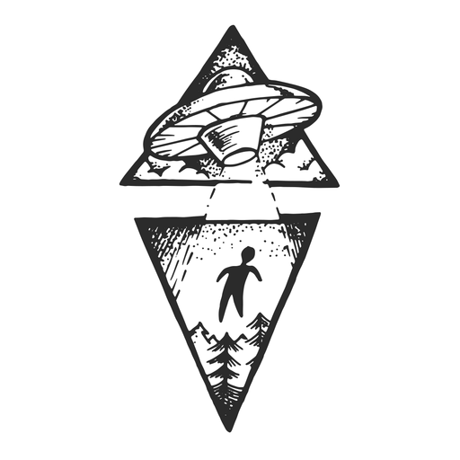
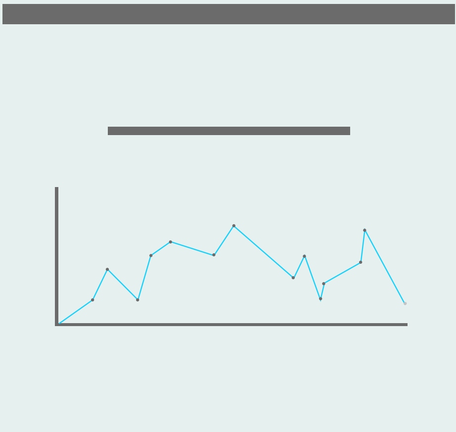
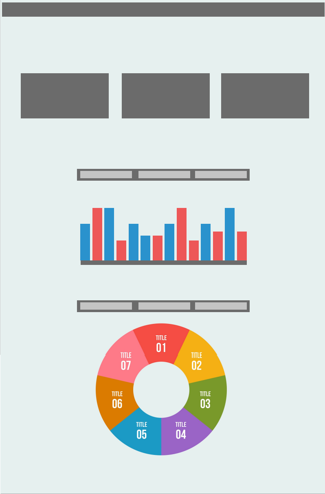
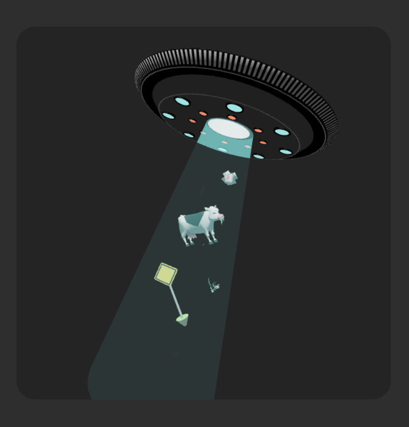

<!-- Repository Information & Links-->
<br />


<!-- HEADER SECTION -->
<h5 align="center" style="padding:0;margin:0;">Simon Riley</h5>
<h5 align="center" style="padding:0;margin:0;">170044</h5>
<h6 align="center">DV200 - Term 1 | 2022</h6>
</br>
<p align="center">

  <a href="https://github.com/SimonR1ley/devtask">
    
  </a>
  
  <h3 align="center">Alien Spotter</h3>

  <p align="center">
    A react project using a UFO Sighting Api from data.world to demonstrate data visualization using charts js  <br>
    
   <br />
   <br />
   <a href="path/to/demonstration/video">View Demo</a>
    ·
    <a href="https://github.com/SimonR1ley/devtask/issues">Report Bug</a>
    ·
    <a href="https://github.com/SimonR1ley/devtask/issues">Request Feature</a>
</p>
<!-- TABLE OF CONTENTS -->

## Table of Contents

* [About the Project](#about-the-project)
  * [Project Description](#project-description)
  * [Built With](#built-with)
* [Getting Started](#getting-started)
  * [Prerequisites](#prerequisites)
  * [How to install](#how-to-install)
* [Features and Functionality](#features-and-functionality)
* [Concept Process](#concept-process)
   * [Ideation](#ideation)
   * [Wireframes](#wireframes)
   * [Custom UI](#user-flow)
* [Development Process](#development-process)
   * [Implementation Process](#implementation-process)
        * [Highlights](#highlights)
        * [Challenges](#challenges)
   * [Future Implementation](#peer-reviews)
* [Final Outcome](#final-outcome)
    * [Mockups](#mockups)
    * [Video Demonstration](#video-demonstration)
* [Conclusion](#conclusion)
* [License](#license)
* [Contact](#contact)
* [Acknowledgements](#acknowledgements)

<!--PROJECT DESCRIPTION-->
## About the Project
<!-- header image of project -->


### Project Description

This app shows the number of UFO sightings from 1950 till 2022. You can also read witness sighting reports from an year you choose.

### Built With

* [React](https://reactjs.org/)
* [ChartJS](https://www.chartjs.org/)
* [React Three](https://www.npmjs.com/package/@react-three/fiber)

<!-- GETTING STARTED -->
<!-- Make sure to add appropriate information about what prerequesite technologies the user would need and also the steps to install your project on their own mashines -->
## Getting Started

The following instructions will get you a copy of the project up and running on your local machine for development and testing purposes.

### Prerequisites

Ensure that you have the latest version of [NPM](https://www.npmjs.com/) installed on your machine. The [GitHub Desktop](https://desktop.github.com/) program will also be required.

### How to install

### Installation
Here are a couple of ways to clone this repo:

1. GitHub Desktop </br>
Enter `https://github.com/SimonR1ley/devtask.git` into the URL field and press the `Clone` button.

2. Clone Repository </br>
Run the following in the command-line to clone the project:
   ```sh
   git clone https://github.com/SimonR1ley/devtask.git
   ```
    Open `Software` and select `File | Open...` from the menu. Select cloned directory and press `Open` button

3. Install Dependencies </br>
Run the following in the command-line to install all the required dependencies:
   ```sh
   npm install
   ```

4. An API key is not required


<!-- FEATURES AND FUNCTIONALITY-->
<!-- You can add the links to all of your imagery at the bottom of the file as references -->
## Features and Functionality

A feature I was playing around with was adding 3d models to the page. I went onto Blender and created an abduction model which you'll see when downloading the project.

### All The Latest UFO Sighting Data! 

Using the UFO Sighting API from data.world, we have collected and collated all the most relevant UFO Sighting data into once seemless react experience!


<!-- CONCEPT PROCESS -->
<!-- Briefly explain your concept ideation process -->
<!-- here you will add things like wireframing, data structure planning, anything that shows your process. You need to include images-->
## Concept Process

The `Conceptual Process` is the set of actions, activities and research that was done when starting this project.

### Wireframes





### Custom UI



<!-- DEVELOPMENT PROCESS -->
## Development Process

The `Development Process` is the technical implementations and functionality done in the frontend and backend of the application.

I started off this project looking for an API that was intristing and different. I looked through a number of APIs before comming across data.world. The problem with data.world is that there is no endpoint. I downloaded the JSON file and sorted the data then called it through axios.

I then did some very basic wireframing to get a feel for where I wanted to display my charts and data.

From there I started adding all the things I wanted.

### Implementation Process
<!-- stipulate all of the functionality you included in the project -->
<!-- This is your time to shine, explain the technical nuances of your project, how did you achieve the final outcome!-->

* Utilized React `Charts.JS` dependency for Data visualization
* Implemented Routing with `React-Router v6`.
* API End Point: Link here(https://data.world/ck30/ufo-data-nuforc)
* `Plugin` for this.
* ETC.

#### Highlights
<!-- stipulated the highlight you experienced with the project -->
* Seeing how the data gets put in a visual context.
* Problem solving some isses I had, for instance I had an issue populating a section on the page that lets users read sightings from a year they picked

#### Challenges
<!-- stipulated the challenges you faced with the project and why you think you faced it or how you think you'll solve it (if not solved) -->
* A challenge I found was finding an API that had enough comparable data. I would've liked to have an API with more data.
* * I didn't get my Line chart working the way that I wanted. I wanted it to be a little more customizable but struggled to dynamically populate the chart with the information.


#### Above And Beyond

What aspects of this final build contribute to the `Above And Beyond` Component of your brief?
<!-- what did you learn outside of the classroom and implement into your project-->
* I explored react-three to import my 3d model. It was really understandable and quite simple to implement once I understood.
* React-three is a React renderer for threejs. You convert your 3d model using your terminal, once your model is converted it gives you a js file. From there you add a canvas and specify the lighting, zoom controls and orientation of your 3d object. You also link your js file you get when you convert your 3d model.

### Future Implementation
<!-- stipulate functionality and improvements that can be implemented in the future. -->

* Getting my line chart working the way I wanted it too.
* Updating the look of the front end. But I think I'll find an API that has more data so that I can add more comparable sections and fill up the pages a little more.

<!-- MOCKUPS -->
## Final Outcome

### Mockups


<br>


<!-- AUTHORS -->
## Authors

* **Simon Riley** - [SimonR1ley](https://github.com/SimonR1ley)

<!-- LICENSE -->
## License

Distributed under the MIT License. See `LICENSE` for more information.\

<!-- LICENSE -->
## Contact

* **Simon Riley** - [170044@virtualwindow.co.za](170044@virtualwindow.co.za) - [@simonbrettriley](https://www.instagram.com/instagram_handle/) 
* **Project Link** - https://github.com/SimonR1ley/devtask

<!-- ACKNOWLEDGEMENTS -->
## Acknowledgements
<!-- all resources that you used and Acknowledgements here -->
* [React Three](https://www.npmjs.com/package/@react-three/fiber)

